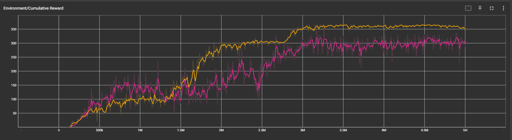

# Qlearning in Unity
By Jacky Xu and Haoyang Liu

## Scene 1: the car racing (playground scene)
we have trained a car to stay on the track to run down to the finish line. 

For both approaches, the states are ray casting out of the car to detect which kind of objects is around. The objects include: [Lawn, Checkpoint, Fence, Track, Finishline], and the number of checkpoints it passed.

### Comparison
- ML-Agent

  - Car01:
The red line is run No.1, which we just setup some imaginary numbers for reward and punishment. As the graph shows, the reward values are very unstable. Furthermore, at around 2.5M episodes, after the car collects all the checkpoints and is ready for Finishline, it turns around and drive for a whole track to reach the Finishline, where the Finishline is actually 2 steps away from the car. As the result, the car is still bumping into the fence for 2, 3 times in one round, sometimes leave the track and drive on the lawn, and drive additional round to get to the finishline.
  - Car02:
To correct it, we upweighted the punishment for fence, increase the reward for stay on track, and add punishment for drive on lawn. As shown in the yellow line, it is more smooth, and the bad decision described above is not happening anymore.
- Q Table

    [Try01](car_q.mp4)
    The Q Table method cannot provide a satisfied result for this environment. First, it runs really slow when putting the training function in `FixedUpdate()`. It takes a second to finish 1 episode with 5000 steps (with `timeScale` at 100), so reaching the 5M as trained in ML-Agent would take 2 months non-stop. In addition, for table-based Q Learning, the number of state will increase exponentially according to the number of observation. Currently, our implementation just have 4 rays to detect 5 types of object and the checkpoint tracker from 0-7, the state in at 10368 (6^4*8) now. The video is the training at around 4000 episodes (reward around -100), which it only runs for 1/4 of the track. So we decided to increase the `maxStep` for each episode to 20000.
    
    [Try02](car_q2.mp4)
    Now, it takes 4 times more time for each episode, and the reward is 4 times worse (around -500). The video is a record for 1000 episodes.
    
    In the third try, we try to increase the learning rate from 0.5 to 0.7 to make it learn faster. It is still training...
    
    Of course, the current episode is too small to make it actually work, but I think the Q table method is still worse than the DeepQ Learning method provide by the ML-Agent, because it is very space and time ineffiencient.
